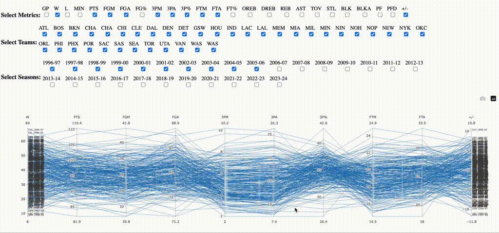

# NBA teams statistics parallel coordinates plot

Visually analyze the NBA teams statistics using parallel coordinates plot.
For example, analyze the impact of 2pt vs 3pt shot frequency on the number of wins in the season.

> The interactive visualization is available at
  [https://marcindulak.github.io/nba-teams-parallel-coordinates](https://marcindulak.github.io/nba-teams-parallel-coordinates).
  You can open the link in a browser, no login is required.

The code uses [plotly.js](https://plotly.com/javascript/parallel-coordinates-plot/),
and is confined to [index.html](./index.html) file.

## Example usage of the parallel coordinate plot

The screencast below uses a feature of parallel coordinates called brushing.
Brushing highlights a group of lines while fading out all the others.

Various observations can be made with the help of brushing.

- In the mid 90's to mid 00's teams were making less 3-pointers (`3PM`), compared to mid 10's and 20's.
  The average number of 3-pointers made per game increased from about 10 to 17, respectively.
  The number of points per game (`PTS`) also increased, by roughly 10 points.

- In the recent years, the association between making more 3-pointers and winning more games (`W`) is more pronounced.

Another interactive feature of parallel coordinates plots, shown on the screencast, is the ability to rearrange the axis.

- Moving the `FTM` (free-throws made) axis between `W` and `PTS` results in a number of crossing lines.
  On a parallel coordinates plot, this is an indication of a negative correlation - some teams that make many free-throws (they get fouled often) score less points and win less games.



The animated gif, as the one above, can be created from a screen recording, using the command below.

```shell
ffmpeg -i parallel-coordinates-plot-usage.mov -vf "fps=2,scale=1024:-1" -c:v gif parallel-coordinates-plot-usage.gif
```

For more examples of analyzing data with parallel coordinates see the
[Kai Chang - Visually Exploring Multidimensional Data - 2013](https://www.youtube.com/watch?v=ypc7Ul9LkxA)
and
[Parallel Coordinates: Visual Multidimensional Geometry and its Applications - 2016 - Alfred Inselberg](https://www.youtube.com/watch?v=aTkzWEB14Lo) talks.

## Obtain data from NBA.com

**Note** that a copy of the data is already included in this repository.
The instructions below are needed to perform a data update, to add a new season statistics.

https://www.nba.com/termsofuse#nba-statistics on 2024-12-30 allow the use of statistics

> for legitimate news reporting or private, non-commercial purposes

The process of obtaining statistics in the `csv`format needed for visualization is described below,
using the example of `2023-24` season.

Obtain the statistics of all teams in the given season.
Go to https://www.nba.com/stats/teams/traditional?Season=2023-24,
and mouse select the table, including the `Season: 2023-24` text on the top left.
Save the mouse selection as `nba.com/2023-24-Traditional.txt` text file, relative to the root of this repository clone.
Execute the following command, to convert the `nba.com/2023-24-Traditional.txt` file into csv,
and save as `nba.com/2023-24-Traditional.csv`.

```shell
for filename in $(find nba.com -name "*.txt");
do
docker run --rm -it --name 2ptvs3pt -v $PWD:/opt/2ptvs3pt -w /opt/2ptvs3pt node:lts-slim \
       node txt2csv.js --filename ${filename} > ${filename}.csv
done
```

If desired, analogously obtain the statistics of the opponents from https://www.nba.com/stats/teams/opponent?Season=2023-24,
the `txt2csv.js` scripts automatically detects the `Traditional` and `Opponents` statistics file format.

Then join the selected csv files into one `nba.com.csv`.

```shell
cp nba.com/1996-97-Traditional.txt.csv nba.com.csv
grep -v Statistics nba.com/1997-98-Traditional.txt.csv >> nba.com.csv
grep -v Statistics nba.com/1998-99-Traditional.txt.csv >> nba.com.csv
grep -v Statistics nba.com/1999-00-Traditional.txt.csv >> nba.com.csv
grep -hv Statistics nba.com/2*-Traditional.txt.csv >> nba.com.csv
sed -i '' 's/LA Clippers/Los Angeles Clippers/' nba.com.csv
```
